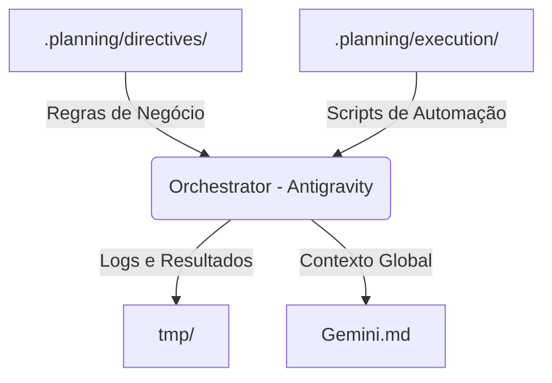

# ♊ Gemini.md - Project Blueprint

> **Status:** [Audit Completed / Planning Phase]
> **Framework:** DOE (Directive, Orchestration, Execution)
> **Owner:** Antigravity Agent

---

## 📦 Principais Recursos (Features)

Sistema elegante de convites e gestão de presença para o casamento de **Kaio & Débora**.

- **✨ Convite Digital:** Landing page premium com estética gold/minimalista.
- **📝 Gestão de RSVP:** Formulário integrado para confirmação de padrinhos e convidados.
- **🔐 Painel Administrativo:** Dashboard para acompanhamento de métricas e exportação de dados (CSV).
- **🧠 IA Brain:** Antigravity para automação e evolução do design.
- **📊 Persistência:** Supabase (Auth + Database) para gestão de estado e segurança.

---

## ⚖️ Regras de Negócio (Business Rules)

### 1. Comunicação & Tom de Voz
- **Naturalidade:** Respostas diretas e profissionais.
- **Estética:** Manter o padrão visual "Premium/Wedding" em todas as novas interfaces.

### 2. Protocolos do Sistema
- **RSVP:** Toda confirmação deve ser persistida no Supabase.
- **Segurança:** Acesso ao painel admin restrito via `user_roles`.
- **DOE:** Seguir estritamente a estrutura de pastas proposta.

---

## 🖥️ Páginas & Fluxos (Workflows)

| Página | Descrição | Status |
| :--- | :--- | :--- |
| **Landing (Index)** | Convite e RSVP | ✅ Completo |
| **Confirmação** | Feedback positivo | ✅ Completo |
| **Recusa** | Feedback negativo | ✅ Completo |
| **Admin Login** | Acesso seguro | ✅ Completo |
| **Admin Dashboard**| Gestão de Convidados | ✅ Funcional |

---

## 🏗️ Estrutura do Projeto (DOE Framework)

- **Directives:** Localizado em `.planning/directives/`.
- **Execution:** Localizado em `.planning/execution/`.

---

> [!TIP]
> **Próximo Passo:** Implementar Lista de Presentes e Integração de Mapas para completar a experiência do convidado.
